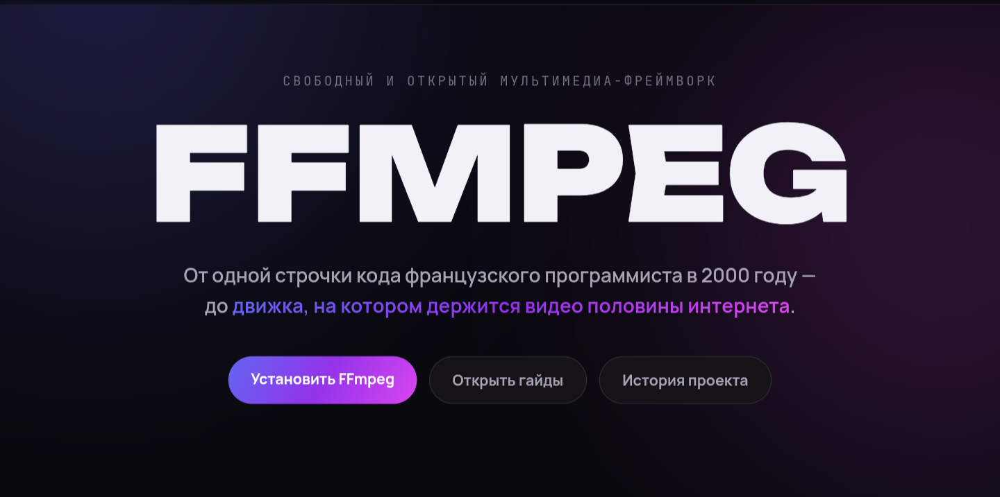
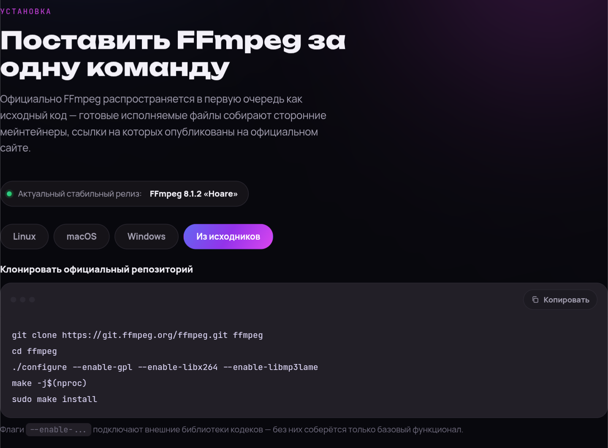
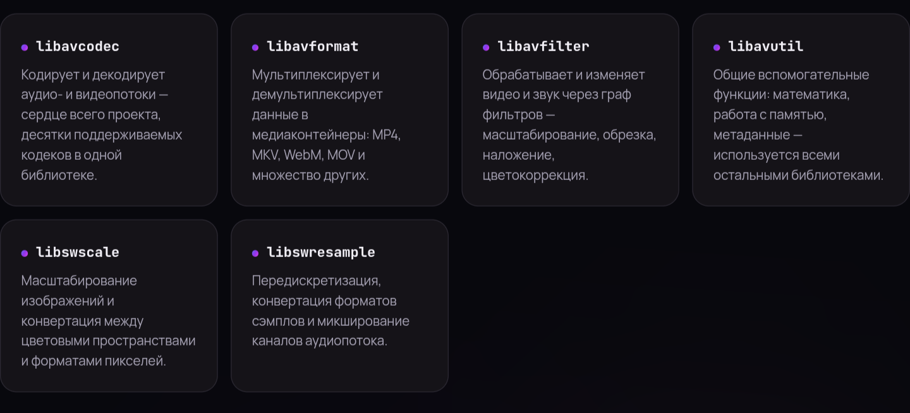

# 🎬 FFmpeg Guide — Интерактивный веб-справочник

  
  
  
  

---

**FFmpeg Guide** — это стильный, современный и полностью интерактивный русскоязычный справочник по консольной утилите **FFmpeg** («швейцарскому ножу» для работы с видео и аудио). 

Уникальность этого проекта в том, что он был полностью спроектирован, сверстан и запрограммирован с помощью нейросети **Claude AI**, став живым примером того, как современные технологии позволяют создавать потрясающие веб-интерфейсы без глубоких знаний фронтенда!

🔥 **Живой сайт доступен здесь:** [https://pashafox569.github.io/ffmpeg-guide/](https://pashafox569.github.io/ffmpeg-guide/)

---

## 📸 Галерея проекта

Ниже представлены ключевые разделы нашего интерактивного справочника.

### 🌟 1. Главный экран
Эстетичный темный интерфейс с глубоким неоновым свечением, плавными анимациями фона и крупной, цепляющей типографикой.

### 💻 2. Интерактивная установка
Удобные переключаемые вкладки (Tabs) для выбора вашей операционной системы (Windows, macOS, Linux). Команды установки можно скопировать в один клик благодаря встроенному скрипту буфера обмена.

### 🗃️ 3. Карточки библиотек и шпаргалка по командам
Аккуратная сетка (Grid) со списком ключевых библиотек FFmpeg (`libavcodec`, `libavformat`, `libavfilter` и др.) и готовыми паттернами команд под любые медиа-задачи.

---

## 🔑 Ключевые особенности

*   🎨 **Дизайн:** Мягкие градиентные свечения, кастомные hover-эффекты и профессионально подобранные шрифты (`Unbounded` и `Manrope`).
*   📱 **100% Адаптивность (Responsive):** Сайт идеально оптимизирован под любые устройства — от широкоформатных мониторов до экранов мобильных телефонов.
*   📋 **Интерактив на лету:** Быстрое копирование терминальных команд в один клик с визуальным подтверждением.
*   🧭 **Удобная навигация:** Структурированное верхнее меню с выпадающими списками (Dropdowns) для моментального перехода к нужной категории (Конвертация, Монтаж, Работа с фото).

---

## 🛠️ Технологический стек

Проект создан на чистом веб-стеке без тяжелых фреймворков, что обеспечивает моментальную загрузку:
*   **HTML5** — семантическая структура документа.
*   **CSS3** — кастомные CSS-переменные (Variables), Flexbox/Grid-сетки, анимации `@keyframes` и сложные фильтры размытия (`backdrop-filter`).
*   **Vanilla JS** — чистый JavaScript для реализации логики вкладок, интерактивного меню и работы с `navigator.clipboard`.
*   🤖 **Claude AI** — дизайн-концепт, архитектура кода и полировка интерфейса.

---
